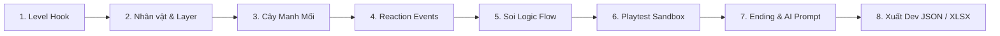

# SẮP XẾP DRAMA — Live Level Editor V1.35 · Figma Suite & Playtest Polish

> **Level Editor & Game Design Production Tool** chuyên dụng cho thể loại game giải đố kịch bản logic (Drama / Story Puzzle).

🌐 **Trải nghiệm trực tiếp:** [https://glgt67.github.io/Tool_level_dramapuzzle/](https://glgt67.github.io/Tool_level_dramapuzzle/)

---

## 🚀 Có gì mới ở Bản V1.35 (Figma Vector Suite & Playtest Polish)?

Phiên bản **V1.35** mang đến bộ công cụ thiết kế hình học vector mở rộng kiểu Figma, chuẩn hóa trải nghiệm kiểm thử gameplay Play Mode, sửa dứt điểm các lỗi giao diện modal và thiết lập quy trình kiểm thử tự động cô lập, bảo toàn mã nguồn Git sạch sẽ 100%.

### 1. 🎨 Bộ Vector Shapes Chuẩn Figma (Full Shape Suite)
- **Đa dạng hình khối vector SVG:**
  - ★ **Ngôi sao (Star):** Vẽ hình ngôi sao 5 cánh cân đối, hỗ trợ đổ màu fill, viền stroke và bóng đổ.
  - ⬡ **Đa giác (Polygon):** Vẽ hình lục giác sắc nét, viền chọn ánh neon mượt mà.
  - ― **Đường thẳng (Line):** Vẽ đường line chỉ dẫn vector, tùy biến hướng và độ dài.
  - ▲ **Tam giác (Triangle), ● Hình tròn (Circle), ■ Hình chữ nhật (Rect):** Kế thừa và chuẩn hóa với bộ công cụ Figma.
- **Tùy chỉnh bo góc chữ nhật (Corner Radius):**
  - Thanh trượt chỉnh bo góc trực tiếp từ `0px` (vuông vức) đến `60px` (bo tròn mượt mà) ngay trong thanh Inspector.
- **Tùy biến Stroke nâng cao:**
  - Tùy chỉnh độ dày nét vẽ (`1px` đến `30px`).
  - Chọn kiểu nét viền: `Solid` (nét liền), `Dashed` (nét đứt đoạn), `Dotted` (nét chấm bi tròn).
- **Thao tác nhanh:**
  - Nút **Nhân bản (Duplicate)** đối tượng tức thì.
  - Nút **Đổi thứ tự độ sâu (Front / Back)** giúp sắp xếp lớp hiển thị trực quan.

### 2. 🟢 Phục Hồi Chú Thích Độ Ưu Tiên (Phase Priority Dots)
- Khôi phục bảng chú thích trực quan trong thanh Inspector:
  - 🟢 **Làm ngay** (High priority / Phase 1)
  - 🟡 **Khi cần** (Medium priority / Phase 2)
  - 🔵 **Làm sau** (Optional / Polish)
- Giữ vững tiêu chuẩn thiết kế phẳng, hiện đại (Studio Aesthetic), loại bỏ hoàn toàn các emoji thừa gây rối mắt trên nhãn và form nhập liệu.

### 3. 🛠️ Khắc Phục Triệt Để 3 Modal Giao Diện
- **Modal FLOW (Solve Graph):**
  - Chuyển layout sang CSS Grid (`grid-template-rows: 52px 1fr`, chiều cao `min(860px, 92vh)`).
  - Vùng nội dung `.logicFlowBody` có thanh cuộn độc lập (`overflow-y: auto`), loại bỏ triệt để tình trạng tràn chữ ra ngoài màn hình.
- **Modal TEST ĐỘ KHÓ:**
  - Loại bỏ hoàn toàn hộp thoại `alert(...)` gây chặn luồng trải nghiệm.
  - Mở trực tiếp giao diện phân tích độ khó: cho phép Game Designer tự đánh giá cảm nhận sau khi chơi và bấm **ĐỐI CHIẾU** với mục tiêu thiết kế ban đầu.
- **Modal ENDING (Ending Maker):**
  - Tái cấu trúc theo lưới 2 cột chuyên nghiệp (`grid: 380px 1fr`): cột trái hiển thị preview khung Ending (tỉ lệ 4:3), cột phải chứa form nhập liệu (Brief, AI Prompt, Ending Line, Verdict CTA).
  - Cả 2 cột cuộn độc lập, vừa vặn trên mọi độ phân giải màn hình.

### 4. 🎮 Tối Ưu Giao Diện Playtest (Play Mode Layout)
- **Căn giữa sân khấu tự động:** Bổ sung `margin: 0 auto` cho `#stage` trong Play Mode, giữ tỉ lệ $1080 \times 1610$ luôn ở chính giữa màn hình.
- **Ẩn thanh công cụ vẽ (#sceneTools):** Khi chuyển sang Play Mode, thanh công cụ vẽ tự động ẩn đi, giải phóng 100% tầm nhìn cho người chơi.
- **Reset Zoom & Pan thông minh:** Mỗi khi vào Play Mode, Canvas tự động đặt về tỉ lệ `1:1` (`canvasZoom = 1.0`) và tọa độ gốc `(0, 0)`.
- **Khay nhân vật luôn trong tầm mắt:** Điều chỉnh chiều rộng Stage trong Play Mode tối đa `390px`, đảm bảo khay nhân vật (`.trayrow`) hiển thị trọn vẹn ở đáy màn hình mà không cần phải cuộn trang.

### 5. 🔄 Cuộn Viền Artboard Tự Động (Border Auto-Wrap 60%)
- Khi di chuyển ảnh tham khảo hoặc hình khối ra ngoài biên sàn diễn quá 60% kích thước (cả chiều ngang và dọc), đối tượng sẽ tự động nhảy sang mép đối diện của Artboard.
- Tích hợp công tắc bật/tắt (Toggle Wrap) trực tiếp trong Inspector.

### 6. 🧪 Quy Chuẩn Kiểm Thử Cô Lập (Clean Git Architecture)
- Toàn bộ script kiểm thử E2E tự động (`test_*.py`, `inspect_*.py`) và ảnh chụp màn hình kiểm tra (`*.png`) được chuyển vào thư mục riêng `tests_sandbox/`.
- Cấu hình file `.gitignore` nghiêm ngặt, ngăn chặn 100% file rác và artifacts kiểm thử dính vào Git commits.

### 7. 🧩 Kiến Trúc Module Bóc Tách (Decoupled Modular Architecture)
- Nhằm tối ưu hóa hiệu năng, giảm tải token cho AI coding assistants và giúp lập trình viên không phải nạp file đơn khối 12MB mỗi khi phát triển tính năng mới:
  - **`index.html` (~19 KB):** Khung sườn HTML semantic siêu nhẹ, liên kết tài nguyên qua link/script tags (giảm 99.85% dung lượng so với bản 12.3 MB cũ).
  - **`css/style.css` (~38 KB):** Toàn bộ hệ thống giao diện Studio Dark/Light mode, dock công cụ và modals.
  - **`data/sample_levels.js` (~12 MB):** Cô lập hoàn toàn dữ liệu tĩnh và hình ảnh base64 của 2 màn chơi mẫu (`sample()` và `sampleBirthday()`).
  - **`js/app.js` (~196 KB):** Toàn bộ logic tương tác canvas, Figma tools, inspector, solve flow, play mode.

---

## 📜 Lịch Sử Phiên Bản Trước

<b>V1.34 · Border Wrap 60% & Studio UI Overhaul</b>

- Tích hợp cơ chế cuộn viền Artboard 60%.
- Đại trùng tu UI/UX chuẩn Studio: loại bỏ emoji thừa trên tiêu đề và input, chuẩn hóa typography và phase dots.
- Tinh chỉnh kích thước thanh công cụ nổi 46px với nút 36px chống tràn viền.

<b>V1.33 · Production Suite & Zoom Stability</b>

- Khôi phục menu Production & More trên thanh điều hướng.
- Sửa triệt để bug zoom bị thu ngược về tỉ lệ 1:1 khi thao tác.
- Bổ sung phím tắt nhân bản nhanh `Alt + Drag`.

<b>V1.32 · Photoshop Suite & Clue Reorder</b>

- Tâm xoay và lật ở chính giữa (`transform-origin: center center`) cho mọi Reference Layer.
- Bộ công cụ chỉnh sửa ảnh Photoshop: Mix-blend-mode (Multiply, Screen, Overlay...), thanh trượt Brightness, Contrast, Saturation, Blur, Corner Radius, Shadow, và Quick Presets.
- Đổi thứ tự Manh mối linh hoạt qua kéo thả chuột (Drag & Drop) hoặc nút `▲ Lên` / `▼ Xuống`.
- Tinh chỉnh vector mũi tên với `markerUnits="userSpaceOnUse"`.

<b>V1.30 · Figma Canvas & SVG Precision</b>

- Chuyển đổi render hình tam giác sang SVG Polygon đa giác thực tế.
- Bộ công cụ Transform kiểu Figma: Flip H, Flip V, Rotate tự do, Opacity slider.
- Điều hướng Canvas trực quan: Pan bằng `Spacebar + Kéo chuột`, Zoom từ 50% đến 200%.
- Thanh Smart Multi-Alignment căn lề nhanh khi chọn nhiều layer.

---

## 📌 Giới Thiệu Tổng Quan

Công cụ hỗ trợ Game Designer (GD) và Content Creator xây dựng, trực quan hóa và kiểm thử các màn chơi giải đố drama tình huống (ngoại tình, đám cưới, drama gia đình, án mạng, v.v.) trực tiếp trên trình duyệt Web:
- Thiết lập kịch bản, nhân vật, ngoại hình và bảng biểu cảm chi tiết.
- Tự động phân tích cây suy luận logic (Solve Graph) để phát hiện ngõ cụt (Deadlock).
- Thử nghiệm gameplay tức thì (Playtest Mode) với cơ chế kéo thả token, trừ mạng và kích hoạt phản ứng.
- Xuất dữ liệu chuẩn cho Lập trình viên (`Dev JSON`) và Họa sĩ (`Asset Request XLSX`).

---

## 🎮 Quy Trình Thiết Kế Màn Chơi Chuẩn (GD Workflow)

### Bước 1: Khởi tạo thông tin màn (`Level Settings`)
- **ID Level:** Mã định danh màn chơi (ví dụ: `L001`, `L002`).
- **Target Difficulty:** Định hướng độ khó dự kiến (Dễ / Vừa / Khó).
- **Drama Hook:** Câu mở đầu kích thích trí tò mò của người chơi ngay khi vào màn.
- **Số Mạng:** Mặc định 2 mạng (❤️❤️) cho mỗi lượt chơi.

### Bước 2: Dựng bối cảnh & Nhân vật
- **Reference Layers & Shapes:** Dán ảnh nền hoặc vẽ hình khối vector phác thảo bố cục sân khấu (Sao, Đa giác, Chữ nhật, Tròn, Tam giác, Đường line, Mũi tên). Kéo thả căn vị trí, chỉnh kích thước, bo góc, xoay, lật và độ sâu z-index.
- **Characters:** Thêm nhân vật Nam (`+M`) hoặc Nữ (`+F`):
  - Gán mã định danh: `M01`, `F01`, `M02`...
  - Thiết lập diện mạo (Appearance tag) và trạng thái ban đầu (Initial emotion, gaze target, hướng lật mặt).
  - Tích hợp token động `{M01}`, `{F02}` giúp tự động đảo tên khi chơi lại.

### Bước 3: Xây dựng Cây Manh Mối (`Clue Tree`)
- **Root Clue:** Manh mối mở đầu hiển thị sẵn cho người chơi.
- **Child Clues:** Manh mối mở khóa tiếp theo khi người chơi đặt đúng nhân vật hoặc kích hoạt drama.
- **Drama Reveal:** Manh mối then chốt lật mở toàn bộ sự thật của màn chơi.
- **Reorder:** Kéo thả đổi vị trí clue trực tiếp trong cây phân cấp.

### Bước 4: Thiết lập Phản ứng Nhân vật (`Reaction Events`)
- Xác định điều kiện kích hoạt: khi đặt nhân vật vào vị trí, hoặc khi 2 nhân vật đứng cạnh nhau.
- Hiển thị biểu cảm cảm xúc (Emoji Picker), bong bóng thoại, hướng nhìn (`Gaze: Left / Right / Target`) và thời lượng hiển thị (`duration`).

### Bước 5: Kiểm định Logic (`Solve Flow Graph`)
- Mở popup **FLOW** để kiểm tra sơ đồ đồ thị SVG tự động:
  - Phân nhánh điều kiện logic **AND** (cần kết hợp nhiều yếu tố) và **OR** (nhiều cách giải hợp lệ).
  - Phát hiện các mắt xích logic bị đứt gãy hoặc deadlock trước khi đưa vào sản xuất.

### Bước 6: Chơi thử nghiệm (`Play Mode Sandbox`)
- Bấm **PLAY** để chuyển sang giao diện người chơi thật:
  - Khay nhân vật (`Tray`) xáo trộn vị trí.
  - Kéo thả nhân vật vào các vị trí trên Stage.
  - Kiểm tra trừ mạng khi thao tác sai và kích hoạt hiệu ứng khi xếp đúng.
- Bấm **TEST ĐỘ KHÓ** để công cụ tự động đối chiếu cảm nhận chơi thực tế với mục tiêu thiết kế.

### Bước 7: Thiết kế Màn Kết (`Ending Maker`)
- Khung hình chiến thắng tỉ lệ ngang chuẩn **4:3**.
- Dòng kết thúc (Ending Line) ngắn gọn, súc tích kèm câu chốt (Punchline).
- Thiết lập phần thưởng Coins và nút xem quảng cáo $\times 2$.
- **AI Prompt Generator:** Tự động tổng hợp dữ liệu màn chơi thành câu lệnh Prompt tiếng Anh chuẩn cho Midjourney/Stable Diffusion để vẽ ảnh recap ending.

### Bước 8: Kiểm duyệt & Xuất bản (`Production Export`)
- Bấm **CHECK**: Chạy bộ linter kiểm tra toàn bộ ID, liên kết và tham chiếu asset.
- Xuất file:
  - `Dev JSON`: File dữ liệu kịch bản nạp thẳng vào engine Unity / Cocos / Godot.
  - `Asset Request XLSX`: Bảng danh mục hình ảnh, biểu cảm và đạo cụ cần bàn giao cho Art team.
  - `Scene PNG` / `Ending PNG`: Ảnh chụp thiết kế phục vụ tài liệu GDD.

---

## ⌨️ Phím Tắt & Thao Tác Nhanh (Keyboard Shortcuts)

| Thao tác | Phím tắt / Chuột | Chức năng |
| :--- | :--- | :--- |
| **Pan Canvas** | `Spacebar + Kéo chuột` hoặc `Chuột giữa` | Di chuyển góc nhìn Canvas tự do như Figma / Photoshop |
| **Zoom Canvas** | `Dock Zoom: − / +` hoặc `1:1` | Phóng to / Thu nhỏ Canvas linh hoạt ($50\% - 200\%$) |
| **Dán ảnh** | `Ctrl + V` / `Cmd + V` | Dán ảnh trực tiếp từ clipboard vào Stage canvas |
| **Giữ tỉ lệ ảnh/shape** | `Shift + Kéo điểm neo` | Thay đổi kích thước layer không bị méo hình |
| **Chọn nhiều đối tượng** | `Kéo chuột trái vùng trống` | Quét vùng chọn (Marquee selection) nhiều layer/token |
| **Căn lề đa đối tượng** | `Smart Align Toolbar` (bên Inspector) | Căn Trái, Giữa X, Phải, Trên, Giữa Y, Dưới tức thì |
| **Lật ảnh / Nhân vật** | Nút `Flip H` / `Flip V` | Lật đối xứng theo trục ngang hoặc trục dọc |
| **Xoay layer** | Slider `Rotate` / Nút `+90°` | Xoay hình $0^\circ - 360^\circ$ |
| **Nhân bản đối tượng** | Nút `Duplicate` hoặc `Alt + Kéo` | Nhân bản layer/hình khối nhanh |
| **Độ sâu lớp vẽ** | Nút `Front` / `Back` | Đưa layer lên trên cùng hoặc xuống dưới cùng |
| **Xóa đối tượng** | `Delete` / `Backspace` | Xóa layer, ghi chú hoặc token đang chọn |
| **Hoàn tác** | `Ctrl + Z` / `Cmd + Z` | Undo thao tác vừa thực hiện |
| **Menu thao tác** | `Chuột phải vào đối tượng` | Duplicate, Đổi thứ tự layer, Lock/Unlock |

---

## 📐 Thông Số Kỹ Thuật (Technical Specs)

- **Canvas Viewport:** $1080 \times 1610$ px (chuẩn màn hình dọc Smartphone tỉ lệ 9:16).
- **Ending Image Aspect Ratio:** $4:3$ (tỉ lệ ảnh ngang).
- **Runtime Environment:** 100% Client-side HTML5/CSS3/Vanilla JS (Không yêu cầu Server backend).
- **Lưu trữ dữ liệu:** Lưu/Mở file `.json` trực tiếp từ thiết bị người dùng.
- **Thư mục kiểm thử:** `tests_sandbox/` (tách biệt hoàn toàn qua `.gitignore`).

---

<!-- Maintained by GLGT67 -->
