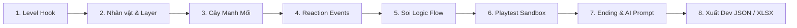

# SẮP XẾP DRAMA — Live Level Editor V1.31 · Studio UI & Dark Mode

> **Level Editor & Game Design Production Tool** chuyên dụng cho thể loại game giải đố kịch bản logic (Drama / Story Puzzle).

🌐 **Trải nghiệm trực tiếp:** [https://glgt67.github.io/Tool_level_dramapuzzle/](https://glgt67.github.io/Tool_level_dramapuzzle/)

---

## 🚀 Có gì mới ở Bản V1.31 (Studio UI & Dark Mode Release)?

1. 🌓 **Chế Độ Giao Diện Tối / Sáng (Dark Mode & Light Mode):**
   - **Obsidian Dark Mode:** Giao diện tối chuyên nghiệp phong cách Figma/Blender/Linear, giảm mỏi mắt khi làm việc ban đêm, bảng điều khiển có độ tương phản chuẩn WCAG AA.
   - **Clean Studio Light Mode:** Giao diện sáng tinh tế, nhẹ nhàng cho môi trường nhiều ánh sáng.
   - **Theme Switcher:** Nút chuyển đổi tức thì `🌙 / ☀️` trên Header kèm tính năng ghi nhớ tự động qua `localStorage`.
2. 📐 **Tái Cấu Trúc Toàn Diện Thanh Điều Hướng (Zero-Overflow Header):**
   - Triệt tiêu hoàn toàn lỗi vỡ dòng/tràn giao diện che khuất sân khấu khi vào chế độ `PLAY`.
   - Phân cụm công cụ trực quan: Brand & Version, Segmented Mode Switcher (`[ EDIT | PLAY ]`), Play Controls Group tự động ẩn/hiện, Audit Tools (`FLOW`, `ĐỘ KHÓ`, `CHECK`), File & Production Tools.
   - Đảm bảo thanh Header luôn nằm gọn trong 1 hàng (non-wrapping) và co giãn linh hoạt theo độ phân giải màn hình.
3. ⚡ **Tối Ưu Hóa Trải Nghiệm Phím Tắt & Modal:**
   - Phím `Esc` để đóng tức thì tất cả cửa sổ Modal (Changelog, Solve Graph, Linter, Test độ khó).
   - Nhấp chuột ra vùng mờ (Backdrop click) để đóng popup tiện lợi.
   - Stage Canvas bao bọc bởi lưới tọa độ Blueprint hiện đại và khung viền Smartphone Bezel sang trọng.

---

## 📌 Giới Thiệu Tổng Quan

Công cụ hỗ trợ Game Designer (GD) và Content Creator xây dựng, trực quan hóa và kiểm thử các màn chơi giải đố drama tình huống (ngoại tình, đám cưới, drama gia đình, án mạng, v.v.) trực tiếp trên trình duyệt Web:
- Thiết lập kịch bản, nhân vật, ngoại hình và bảng biểu cảm chi tiết.
- Tự động phân tích cây suy luận logic (Solve Graph) để phát hiện ngõ cụt (Deadlock).
- Thử nghiệm gameplay tức thì (Playtest Mode) với cơ chế kéo thả token, trừ mạng và kích hoạt phản ứng.
- Xuất dữ liệu chuẩn cho Lập trình viên (`Dev JSON`) và Họa sĩ (`Asset Request XLSX`).

---

## 🎮 Quy Trình Thiết Kế Màn Chơi Chuẩn (GD Workflow)

### Bước 1: Khởi tạo thông tin màn (`Level Settings`)
- **ID Level:** Mã định danh màn chơi (ví dụ: `L001`, `L002`).
- **Target Difficulty:** Định hướng độ khó dự kiến (Dễ / Vừa / Khó).
- **Drama Hook:** Câu mở đầu kích thích trí tò mò của người chơi ngay khi vào màn.
- **Số Mạng:** Mặc định 2 mạng (❤️❤️) cho mỗi lượt chơi.

### Bước 2: Dựng bối cảnh & Nhân vật
- **Reference Layers:** Dán ảnh nền hoặc phác thảo bố cục sân khấu. Kéo thả căn vị trí, chỉnh kích thước, xoay, lật và độ sâu z-index.
- **Characters:** Thêm nhân vật Nam (`+M`) hoặc Nữ (`+F`):
  - Gán mã định danh: `M01`, `F01`, `M02`...
  - Thiết lập diện mạo (Appearance tag) và trạng thái ban đầu (Initial emotion, gaze target, hướng lật mặt).
  - Tích hợp token động `{M01}`, `{F02}` giúp tự động đảo tên khi chơi lại.

### Bước 3: Xây dựng Cây Manh Mối (`Clue Tree`)
- **Root Clue:** Manh mối mở đầu hiển thị sẵn cho người chơi.
- **Child Clues:** Manh mối mở khóa tiếp theo khi người chơi đặt đúng nhân vật hoặc kích hoạt drama.
- **Drama Reveal:** Manh mối then chốt lật mở toàn bộ sự thật của màn chơi.

### Bước 4: Thiết lập Phản ứng Nhân vật (`Reaction Events`)
- Xác định điều kiện kích hoạt: khi đặt nhân vật vào vị trí, hoặc khi 2 nhân vật đứng cạnh nhau.
- Hiển thị biểu cảm cảm xúc (Emoji Picker), bong bóng thoại, hướng nhìn (`Gaze: Left / Right / Target`) và thời lượng hiển thị (`duration`).

### Bước 5: Kiểm định Logic (`Solve Flow Graph`)
- Mở popup **FLOW** để kiểm tra sơ đồ đồ thị SVG tự động:
  - Phân nhánh điều kiện logic **AND** (cần kết hợp nhiều yếu tố) và **OR** (nhiều cách giải hợp lệ).
  - Phát hiện các mắt xích logic bị đứt gãy hoặc deadlock trước khi đưa vào sản xuất.

### Bước 6: Chơi thử nghiệm (`Play Mode Sandbox`)
- Bấm **PLAY** để chuyển sang giao diện người chơi thật:
  - Khay nhân vật (`Tray`) xáo trộn vị trí.
  - Kéo thả nhân vật vào các vị trí trên Stage.
  - Kiểm tra trừ mạng khi thao tác sai và kích hoạt hiệu ứng khi xếp đúng.
- Bấm **TEST ĐỘ KHÓ** để công cụ tự động đối chiếu cảm nhận chơi thực tế với mục tiêu thiết kế.

### Bước 7: Thiết kế Màn Kết (`Ending Maker`)
- Khung hình chiến thắng tỉ lệ ngang chuẩn **4:3**.
- Dòng kết thúc (Ending Line) ngắn gọn, súc tích kèm câu chốt (Punchline).
- Thiết lập phần thưởng Coins và nút xem quảng cáo $\times 2$.
- **AI Prompt Generator:** Tự động tổng hợp dữ liệu màn chơi thành câu lệnh Prompt tiếng Anh chuẩn cho Midjourney/Stable Diffusion để vẽ ảnh recap ending.

### Bước 8: Kiểm duyệt & Xuất bản (`Production Export`)
- Bấm **CHECK**: Chạy bộ linter kiểm tra toàn bộ ID, liên kết và tham chiếu asset.
- Xuất file:
  - `Dev JSON`: File dữ liệu kịch bản nạp thẳng vào engine Unity / Cocos / Godot.
  - `Asset Request XLSX`: Bảng danh mục hình ảnh, biểu cảm và đạo cụ cần bàn giao cho Art team.
  - `Scene PNG` / `Ending PNG`: Ảnh chụp thiết kế phục vụ tài liệu GDD.

---

## ⌨️ Phím Tắt & Thao Tác Nhanh (Keyboard Shortcuts)

| Thao tác | Phím tắt / Chuột | Chức năng |
| :--- | :--- | :--- |
| **Pan Canvas** | `Spacebar + Kéo chuột` hoặc `Chuột giữa` | Di chuyển góc nhìn Canvas tự do như Figma / Photoshop |
| **Zoom Canvas** | `Dock Zoom: − / +` hoặc `1:1` | Phóng to / Thu nhỏ Canvas linh hoạt ($50\% - 200\%$) |
| **Dán ảnh** | `Ctrl + V` / `Cmd + V` | Dán ảnh trực tiếp từ clipboard vào Stage canvas |
| **Giữ tỉ lệ ảnh** | `Shift + Kéo chấm xanh` | Thay đổi kích thước layer không bị méo hình |
| **Chọn nhiều đối tượng** | `Kéo chuột trái vùng trống` | Quét vùng chọn (Marquee selection) nhiều layer/token |
| **Căn lề đa đối tượng** | `Smart Align Toolbar` (bên Inspector) | Căn Trái, Giữa X, Phải, Trên, Giữa Y, Dưới tức thì |
| **Lật ảnh / Nhân vật** | Nút `Flip H` / `Flip V` | Lật đối xứng theo trục ngang hoặc trục dọc |
| **Xoay layer** | Slider `Rotate` / Nút `+90°` | Xoay hình $0^\circ - 360^\circ$ |
| **Xóa đối tượng** | `Delete` / `Backspace` | Xóa layer, ghi chú hoặc token đang chọn |
| **Hoàn tác** | `Ctrl + Z` / `Cmd + Z` | Undo thao tác vừa thực hiện |
| **Menu thao tác** | `Chuột phải vào đối tượng` | Duplicate, Đổi thứ tự layer (Front/Back), Lock/Unlock |

---

## 📐 Thông Số Kỹ Thuật (Technical Specs)

- **Canvas Viewport:** $1080 \times 1610$ px (chuẩn màn hình dọc Smartphone tỉ lệ 9:16).
- **Ending Image Aspect Ratio:** $4:3$ (tỉ lệ ảnh ngang).
- **Runtime Environment:** 100% Client-side HTML5/CSS3/Vanilla JS (Không yêu cầu Server backend).
- **Lưu trữ dữ liệu:** Lưu/Mở file `.json` trực tiếp từ thiết bị người dùng.

<!-- Maintained by GLGT67 -->
